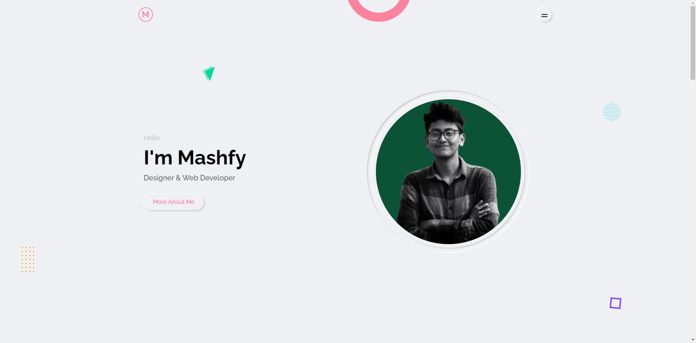

# Personal Portfolio
This static website contains some sections; such as :
* Home
* About
* Services
* Portfolio
* Testimonial
* Contact

### Some notes
As this is a static website (you know the curse of publishing website in github) there is no working contact form in this. But the same project is also implemented in Django [here](https://github.com/Mashfy/portfolioweb) with working contact form.

you can see this static website working [Live Here ](https://mashfy.github.io/mashfyportfolio/)

